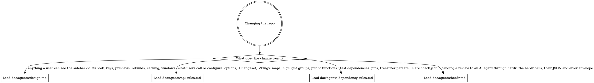

# changeset.nvim

A Neovim sidebar mapping what the current branch changed: its files, and the symbols each
hunk touched. `README.md` is the user reference, and `doc/agents/design.md` records why the
sidebar looks and behaves as it does. Each file under `lua/changeset/` opens with a
one-line summary of what it owns.

## Setup

Run these once in each new clone or worktree, in order:

1. `mise trust`, because mise refuses to load an untrusted `mise.toml`.
2. `mise run setup`, which installs the tools and registers the hk git hooks.
3. `mise run parsers`, because the specs that parse source files fail without the parsers
   `tests/support/parsers.lua` lists.

`mise tasks` lists every other task with what it does.

## Testing

Write a failing spec before any behaviour change.

Run specs with `mise run test [spec ...]`, never `:PlenaryBustedFile`. That command takes
no options, so its child Neovim skips `tests/minimal_init.lua` and can load another
checkout of the plugin: from a worktree, silently the main one.

Specs sit flat in `tests/`, named `<module>_spec.lua` or for a behaviour
(`sidebar_spec.lua`). Each spec file runs in its own child Neovim under
`tests/minimal_init.lua`. It drops your config from `rtp`, gives state and cache temporary
directories, makes `.tests/data` the data directory, and hides your git environment and
global git config.

A spec creates its temporary files and repositories and removes them after. Build them with
the fixtures in `tests/support/`, such as `require("support.git")`, rather than shelling
out to git. Change directory only when the code under test resolves the repository from
the process directory.

A private function a spec needs is exposed as `M._name` on its module. It is not public
API.

## Lua conventions

- Annotate with LuaCATS. A module opens with a one-line `---` summary. A public function
  has a one-line summary plus `---@param` and `---@return`. A type is
  `---@class changeset.<Name>` with `---@field`. A module-level value whose initializer
  hides its type, such as `nil` or an empty table, gets `---@type`. `mise run typecheck`
  checks the annotations that exist, not that they exist.
- A comment says why, never what the code does or how it changed.
- Every `nvim_create_autocmd` says what fires it and why, in a `-- Fires:` comment above it
  or in its `desc`. Every keymap has a `desc`.
- StyLua formats. A global selene rejects goes in `vim.yml`, or in `tests/busted.yml` when
  only specs use it. A `-- selene: allow(...)` suppression sits under a one-line comment
  giving the reason.

## Before a PR

Run `mise run preflight` and make it pass. The pre-commit hook formats and lints the staged
files, and pre-push runs the type check and the suite. Never bypass them with
`--no-verify`.

Follow every `README.md` edit with `mise run format && mise run docs`, and commit the
regenerated `doc/` in the same PR. Format first, because the pre-commit hook's Markdown
fixes change what pandoc renders. CI runs `mise run docs` and fails if `doc/` changes, but
`preflight` does not.

## Routing

Read this digraph as a checklist, not a single path: load every file whose edge matches
your change before you edit that area.

## Keeping docs current

When your change makes a doc wrong or incomplete, update that doc in the same change. A new
rule goes in this file until its area needs a rule file of its own. Add that file's edge to
`## Routing` in the same change.
