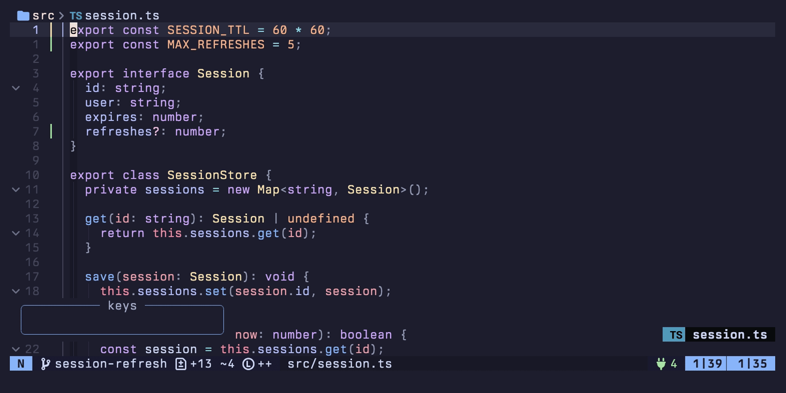

# changeset

changeset.nvim opens a read-only sidebar listing the files your branch changed and, under
each file, the symbols those changes touched.

<!-- panvimdoc-ignore-start -->



<!-- panvimdoc-ignore-end -->

Use it to read a branch before you push it, or one you checked out to review. The same
changes also show in gitsigns' gutter, through [PR Review Mode](#pr-review-mode), and in
mini.pick, through the [Picker](#picker). Each works without the others.

## Requirements

changeset needs Neovim 0.12 or newer and `git`.

Each optional integration adds a feature:

- `gh`: a branch whose open PR targets another branch is compared against that branch.
- A language server that lists a file's symbols (`textDocument/documentSymbol`): the
  symbol rows under each file. Without one, a file lists only its changes.
- Treesitter parsers: finding the tests inside a source file by their syntax, so the
  sidebar lists them under Tests and the file's code under Implementation. Without the
  file's parser, only tests found by name, such as a `tests` module or a `describe` block,
  are split out. With or without a parser, this needs a language server, as the symbol
  rows do. The supported languages, whose parsers nvim-treesitter installs with
  `:TSInstall rust typescript tsx`:
  - Rust, with the `rust` parser: items under `#[test]`, `#[cfg(test)]` or any
    `#[…::test]` attribute, such as `#[tokio::test]`.
  - TypeScript, with the `typescript` parser, or `tsx` for `.tsx` files: an
    `if (import.meta.vitest) { … }` block.

  Parsers also move comment-only changes under Docs: a symbol whose changed lines are all
  comments, or a hunk outside every symbol that changes only comments. This works for any
  language whose parser is installed, and needs no language server.
- mini.icons (once set up) or nvim-web-devicons: icons. nvim-web-devicons covers files
  only.
- which-key: `?` opens its popup instead of a float.
- mini.pick (once set up): the [Picker](#picker).
- gitsigns: [PR Review Mode](#pr-review-mode), and the colours of the status rail (the
  `▎` bar beside each file).

## Installation

With `vim.pack`:

```lua
vim.pack.add({
  "https://github.com/macintacos/changeset.nvim",
  -- Optional:
  "https://github.com/lewis6991/gitsigns.nvim", -- PR Review Mode, status rail colours
  "https://github.com/nvim-mini/mini.icons", -- icons, once set up
  "https://github.com/nvim-mini/mini.pick", -- the Picker, once set up
  "https://github.com/folke/which-key.nvim", -- `?` opens its popup
})
```

With lazy.nvim:

```lua
{
  "macintacos/changeset.nvim",
  dependencies = {
    -- Optional:
    { "lewis6991/gitsigns.nvim", opts = {} }, -- PR Review Mode, status rail colours
    { "nvim-mini/mini.icons", opts = {} }, -- icons
    { "nvim-mini/mini.pick", opts = {} }, -- the Picker
    { "folke/which-key.nvim", opts = {} }, -- `?` opens its popup
  },
}
```

`setup()` is optional: without it, the sidebar uses the defaults in [Options](#options).

With lazy.nvim, put options in the spec as `opts = { … }`, and lazy.nvim calls `setup()`
with them.

## Usage

`:Changeset` opens the sidebar and focuses it, and running it again from the sidebar
closes it. It takes one optional subcommand:

- `:Changeset toggle`, the default: from any other window, opens or focuses the sidebar
  on the row for where your cursor is. From the sidebar, closes it and returns you to your
  window.
- `:Changeset refresh` rebuilds the tree.
- `:Changeset review` turns [PR Review Mode](#pr-review-mode) off, or back on, for the
  current branch. It raises an error unless `pr_review.enabled` is set.

`<Plug>(changeset-toggle)` does what `:Changeset toggle` does.

The sidebar opens on the right of the editor. When the editor is too narrow to leave the
files `layout.min_file_width` columns (80 by default) beside it, the sidebar opens as a
drawer along the bottom instead. It moves between the two as you resize the editor.

The plugin maps no keys outside the sidebar, so map your own. For example:

```lua
vim.keymap.set("n", "<leader>gp", "<Plug>(changeset-toggle)", { desc = "Toggle the changeset sidebar" })
-- :Changeset review needs pr_review.enabled = true
vim.keymap.set("n", "<leader>gP", "<Cmd>Changeset review<CR>", { desc = "Toggle PR Review Mode" })
require("changeset").setup({ keymaps = { next = "]h", prev = "[h" } })
```

## Sidebar keys

Moving through the tree previews each change in the window you were last in, with a band
across the top of that window. `<CR>`, or a split or tab key, opens the change there.

The table lists the default keys, plus `]h` / `[h`, which the [Usage](#usage) example
binds. Rename a sidebar key with its `keymaps` option in [Options](#options).

<!-- The separator rows' dash counts set the vimdoc's column widths; keep their ratios. -->

| Key | Where | Does |
| --- | --- | ------------ |
| `j` / `k` | sidebar | move, previewing into the window you were last in without leaving the sidebar |
| `<CR>` | sidebar | open the change there, focusing that window at the row's line; nothing on a section header |
| `<S-CR>` | sidebar | open the change, then close the sidebar |
| `q` | sidebar | close, return you to your window and put back what each previewed window showed |
| `h` | sidebar | collapse; on a section header, fold its section; with nothing left to collapse, step out to the parent, so repeated `h` walks up to the file and then its section header |
| `l` | sidebar | expand; on a section header, unfold its section; on nested symbols shown as one row, such as `SessionStore › refresh › deadline`, show one row per symbol |
| `H` / `L` | sidebar | collapse / expand every file, the whole-tree form of `h` / `l`; never folds or unfolds a section |
| `]]` / `[[` | sidebar | move to the next / previous section header, folded ones included; stays put when there is none that way |
| `F` | sidebar | open the symbol-kind menu |
| `x` | kind menu | hide or show the kind under the cursor, redrawing the tree at once |
| `<CR>` / `r` / `b` | kind menu | remember this set everywhere / for this repository / for this branch, then close |
| `q` / `<Esc>` | kind menu | close, putting the tree back to the saved set |
| `f` | sidebar | filter as you type, keeping ancestors so matches stay in place and highlighting every match until you clear the filter; `<Esc>` cancels and keeps the previous filter |
| `R` | sidebar | rebuild now |
| `y` | sidebar | copy the row's `path:line` to the clipboard; nothing on a section header |
| `/` `-` `<C-t>` | sidebar | open the change in a vsplit / split / new tab instead |
| `?` | sidebar | list the keys the sidebar bound, `keymaps.next` / `keymaps.prev` included when set: which-key's popup where it is installed, a float where it is not |
| `]h` / `[h` | anywhere, while open | off unless set as `keymaps.next` / `keymaps.prev`; move the sidebar's selection to the next / previous row, previewing it and skipping section headers, so you can review without focusing the sidebar |

Opening a change adds a jumplist entry, so `<C-o>` returns to where that window was before
the sidebar opened. Previewing adds none.

The symbol-kind menu remembers the kinds you hide for this branch, this repository or
everywhere. The narrowest scope with a saved set wins.

## PR Review Mode

PR Review Mode makes gitsigns' gutter mark everything the branch changed, not only
uncommitted work, by comparing against the same fork point as the sidebar.

Turn it on in `setup()`. It requires gitsigns, and uses `gh`, when present, to find an
open PR's target branch.

```lua
require("changeset").setup({ pr_review = { enabled = true } })
```

It turns itself on for every branch except the default. `:Changeset review` turns it off,
or back on, for the current branch until Neovim exits.

It works without the sidebar, and the sidebar works without it.

## Picker

With mini.pick set up, `require("changeset.pick").pick()` searches the same changes as the
sidebar.

`:Pick changeset` works too when mini.pick is set up by the end of startup. If you set up
mini.pick later, register the picker yourself:

```lua
MiniPick.registry.changeset = function() return require("changeset.pick").pick() end
```

## Options

Pass options to `require("changeset").setup()` as nested tables:

```lua
require("changeset").setup({ keymaps = { jump = "o" } })
```

Any `keymaps` entry can be `false` to leave that key unbound.

<!-- The separator rows' dash counts set the vimdoc's column widths; keep their ratios. -->

| Option | Default | Description |
| --------- | --- | --------------- |
| `keymaps.jump` | `<CR>` | Go to this change |
| `keymaps.jump_close` | `<S-CR>` | Go to this change and close the sidebar |
| `keymaps.jump_vsplit` | `/` | Go to this change in a vertical split |
| `keymaps.jump_split` | `-` | Go to this change in a split |
| `keymaps.jump_tab` | `<C-t>` | Go to this change in a new tab |
| `keymaps.close` | `q` | Close the sidebar |
| `keymaps.expand` | `l` | Expand |
| `keymaps.collapse` | `h` | Collapse, or step out to the parent |
| `keymaps.collapse_all` | `H` | Collapse every file |
| `keymaps.expand_all` | `L` | Expand every file |
| `keymaps.next_section` | `]]` | Next section header |
| `keymaps.prev_section` | `[[` | Previous section header |
| `keymaps.refresh` | `R` | Rebuild the tree |
| `keymaps.yank` | `y` | Copy `path:line` |
| `keymaps.help` | `?` | List the sidebar's keys |
| `keymaps.filter_kinds` | `F` | Open the symbol-kind menu |
| `keymaps.filter` | `f` | Filter the tree |
| `keymaps.next` | `false` | Next row, from any window |
| `keymaps.prev` | `false` | Previous row, from any window |
| `layout.min_file_width` | `80` | Narrowest the files get beside the sidebar before it moves below them |
| `pr_review.enabled` | `false` | PR Review Mode on every branch but the default |

The step keys, `keymaps.next` and `keymaps.prev`, are off by default. Once set, they work
from any window, but only while the sidebar is open. Whatever they replaced comes back
when it closes.

Each `setup()` call starts from the defaults, not from the previous call. The sidebar
picks up its options the next time it opens. Turning on `pr_review.enabled` takes effect
at once, but turning it off again takes a restart. An invalid value raises an error
naming the option, and the previous configuration stays in force.

## Highlight groups

The sidebar derives each group's default from your colorscheme, and derives it again on
`:colorscheme`.

| Group | Colours | Default |
| --------- | ------------ | ---------- |
| `ChangesetMeta` | Text that is not content: counts, notes | `Comment`'s colour, italic |
| `ChangesetMatch` | Characters a filter matched | links to `Search` |
| `ChangesetHidden` | A kind the tree is not showing, in the kind menu | `Comment`'s colour, struck through |
| `ChangesetHeader` | The sidebar's header strip | `TabLine`'s background |
| `ChangesetHeaderIcon` | The branch glyph on the header | `Directory`'s colour on the header |
| `ChangesetHeaderDim` | The remote, nouns and PR on the header | `Comment`'s colour on the header |
| `ChangesetHeaderRef` | The ref the tree is compared against | `Normal`'s colour on the header, bold |
| `ChangesetBadge` | The badge in the footer | `Directory`'s colour, reversed, bold |
| `ChangesetFooter` | The footer's text | `Comment`'s colour on `StatusLine` |
| `ChangesetFooterKey` | Keys and the filter in the footer | `StatusLine`, bold |
| `ChangesetSelected` | The sidebar's cursor row while focused | `Normal`'s background tinted toward `Statement` |
| `ChangesetHere` | The row for where your cursor is | a lighter `Statement` tint |
| `ChangesetPicked` | The row last opened from the sidebar | a lighter `Statement` tint |
| `ChangesetSelectedIcon` | The glyph on the selected row | `Statement`'s colour |
| `ChangesetHereIcon` | The glyph on the row for where you are | `Statement`'s colour |
| `ChangesetPickedIcon` | The glyph on the row last opened | `Statement`'s colour |
| `ChangesetNoCursor` | The cursor while in the sidebar, hidden | fully blended |
| `ChangesetPreview` | The band over a window being previewed into | `CursorLine`'s background, else `Visual`'s |
| `ChangesetPreviewLabel` | The badge at the head of that band | `DiagnosticWarn`'s colour, reversed, bold |
| `ChangesetPreviewHint` | The hint at the tail of that band | `Comment`'s colour on the band, italic |
| `ChangesetPreviewIcon` | The file's glyph on that band | the file icon's colour on the band |

A colorscheme's definition of a group wins. So does your own `nvim_set_hl`, until the
next `:colorscheme` clears it. To keep an override across colorscheme changes, set it from
a `ColorScheme` autocmd:

```lua
vim.api.nvim_create_autocmd("ColorScheme", {
  callback = function()
    vim.api.nvim_set_hl(0, "ChangesetMatch", { link = "IncSearch" })
  end,
})
```

`ChangesetPreviewIcon` is recoloured for each file, so defining it paints every file's
glyph one colour. The status rail beside each file uses gitsigns' `GitSignsAdd`,
`GitSignsChange`, `GitSignsDelete` and `GitSignsUntracked`.

## Health

`:checkhealth changeset` reports the requirements, each optional integration the sidebar
does without, and the options in force.

It loads plugins the way the sidebar does, so it may load one your plugin manager
deferred. It installs nothing, starts no language server and makes no network request.

## Where state is stored

- The symbol cache: one JSON file per repository under `stdpath("cache")/changeset/`. You
  can delete it; the next build is slow once.
- Hidden symbol kinds: `stdpath("state")/changeset/filters.json`.
- Sessions: `:mksession` restores the sidebar when `'sessionoptions'` contains `blank`
  (the default), and its cursor row too when it also contains `globals`.
- Folds: kept in memory per repository until Neovim exits.

<!-- panvimdoc-ignore-start -->

Contributors: the design and the reasons behind it are in
[doc/agents/design.md](doc/agents/design.md).

<!-- panvimdoc-ignore-end -->
